# ToDo (Wails · Go + JavaScript)

A simple cross‑platform desktop To‑Do app built with **Wails v2**, **Go** (backend) and **vanilla JS/CSS** (frontend).  
The app lets you add, edit, complete/undo, delete and browse tasks; state is persisted locally between runs.

---

## ✨ Features

- **Add tasks** with validation (no empty titles)
- **Priority**: low / medium / high
- **Due date & time**
- **Mark as done / Undo**
- **Delete** (with modal confirm)
- **Search** by title
- **Filter**: All / Active / Completed
- **Date filters**: Today · This week · Overdue
- **Sort**: Newest · Oldest · Due ↑/↓ · Priority
- **Dark/Light theme** toggle
- **Persistence**: tasks are stored in a local JSON file (`tasks.json`)

---

## 🧱 Tech Stack

- **Go** + **Wails v2**
- **JavaScript**
- **CSS** + **HTML**

---

## ▶️ Getting started

### Prerequisites
- Go 1.21+
- Node.js 18+
- Wails CLI: `go install github.com/wailsapp/wails/v2/cmd/wails@latest`

### Navigate to project folder
Before running any commands, make sure you are inside the project directory:
```bash
cd .\TodoApp\
```

### Dev run
```bash
wails dev
```
This runs the Wails app.

### Build (production)
```bash
wails build
```
The compiled desktop app will be produced under `build/` for your platform.

### Data location
Tasks are saved in `tasks.json` in the app working directory. Deleting this file resets the app data.

---

## 🧪 How to use (quick demo script)

1. Add a task with title, priority and due time.  
2. Use **Search** to filter by title.
3. Switch **All/Active/Completed** view chips.
4. Try **Date filters**: Today / This week / Overdue.
5. Sort Active/Completed lists via the dropdowns (Due ↑/↓, Priority, etc.).
6. Mark a task **Done** and then **Undo** it.
7. Click **Edit** on a task, change fields and **Save**.
8. **Delete** a task (confirm in the modal window).
9. Toggle **Dark/Light** theme.
10. Close and reopen the app — your tasks persist.

---

## ✅ Test Task Checklist mapping

- **UI (base)**: input, button, list, CSS, done/undone markers — **done**  
- **UI (bonus)**: dark/light theme — **done**
- **Add (base)**: add new task + empty input validation — **done**
- **Add (bonus)**: due date & time, priority — **done**
- **Delete (base)**: delete task — **done**
- **Delete (bonus)**: modal confirmation — **done**
- **Complete/Undo (base)** — **done**
- **Persistence (base)**: state saved between runs — **done** (JSON file)
- **Filter & Sort (base)**: by status, by date — **done**
- **Extra**: date scopes (Today/Week/Overdue), sort by priority, inline edit, search — **done**

---

## 📷 Screenshots

- **Main UI (Light) — главная страница**

  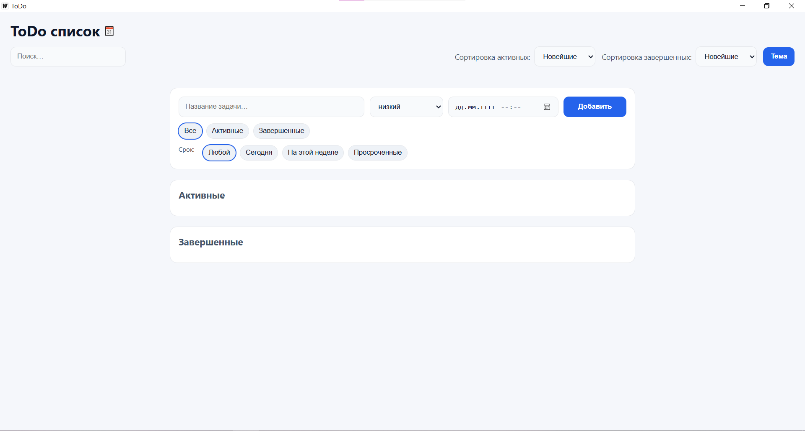

- **Main UI (Dark) — тёмная тема**

  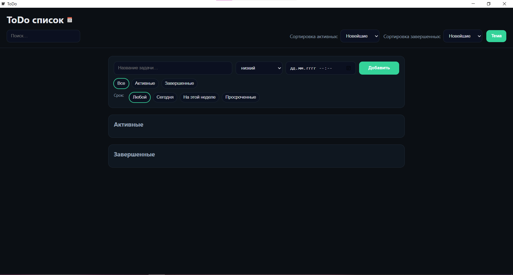

- **Валидация: пустой заголовок**

  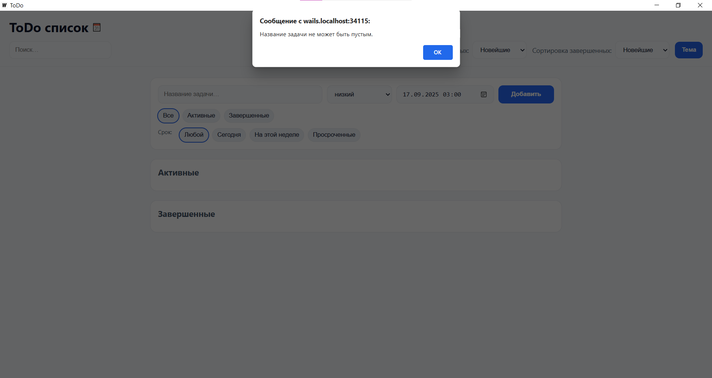

- **Добавление: срок + приоритет**

  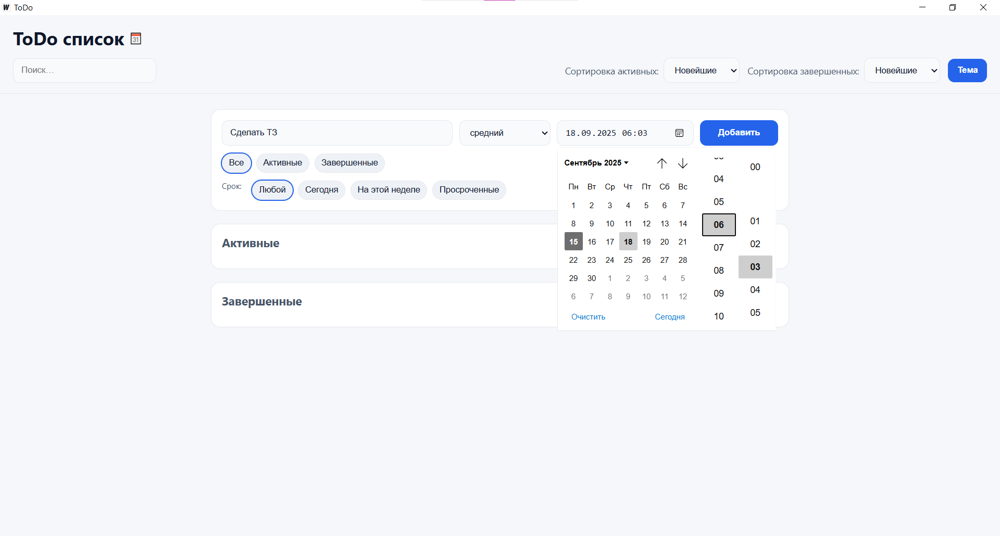
  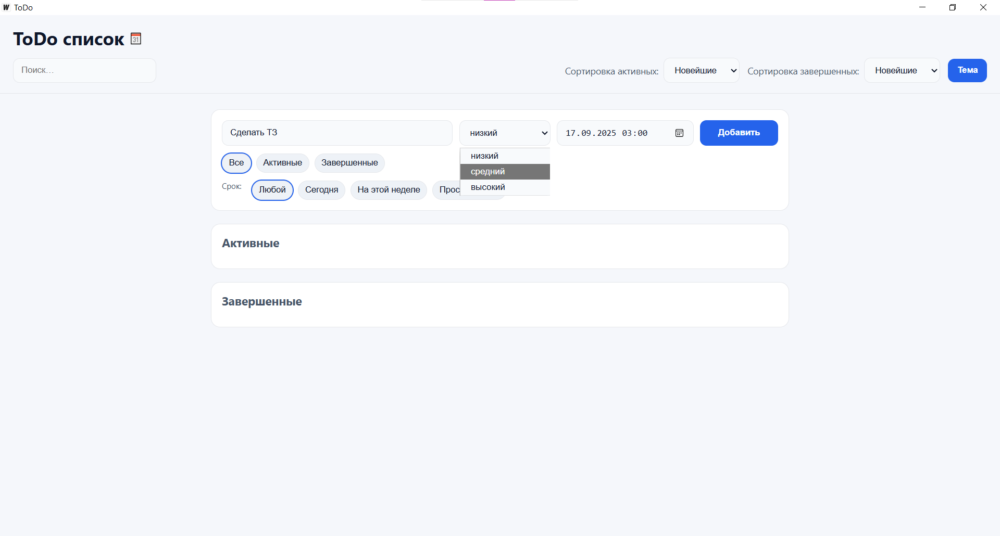

- **Список активных задач**

  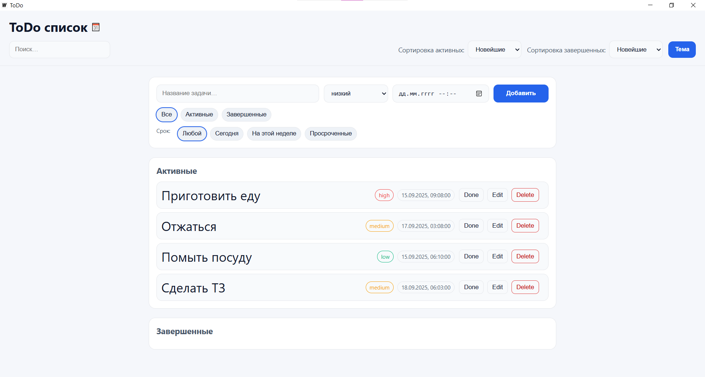

- **Список завершённых задач**

  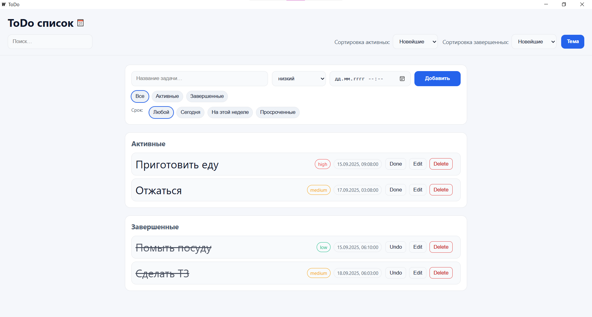

- **Фильтр дат: Просроченные**`

  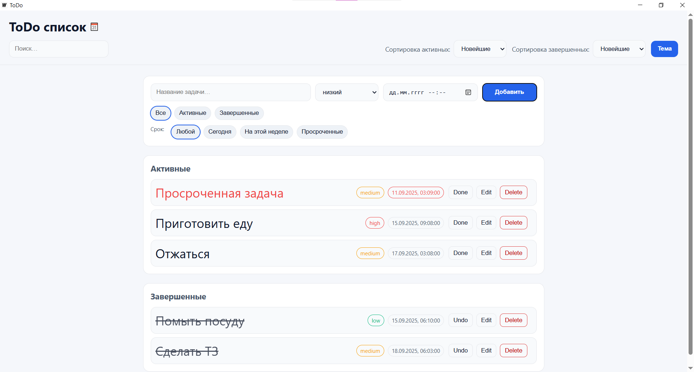

- **Сортировка: Due/Priority**

  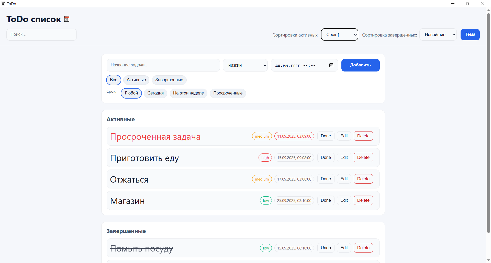
  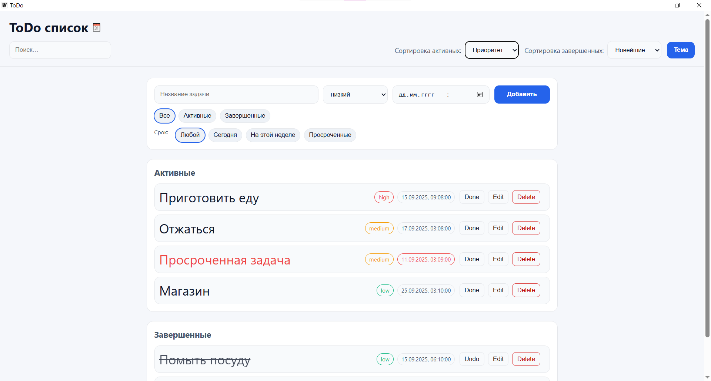

- **Поиск по названию**

  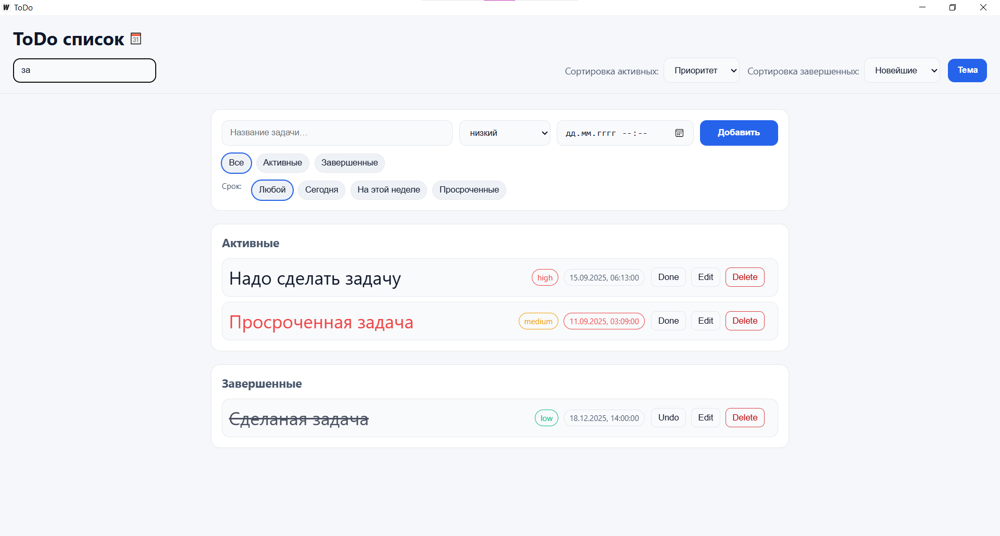

- **Inline‑редактирование**

  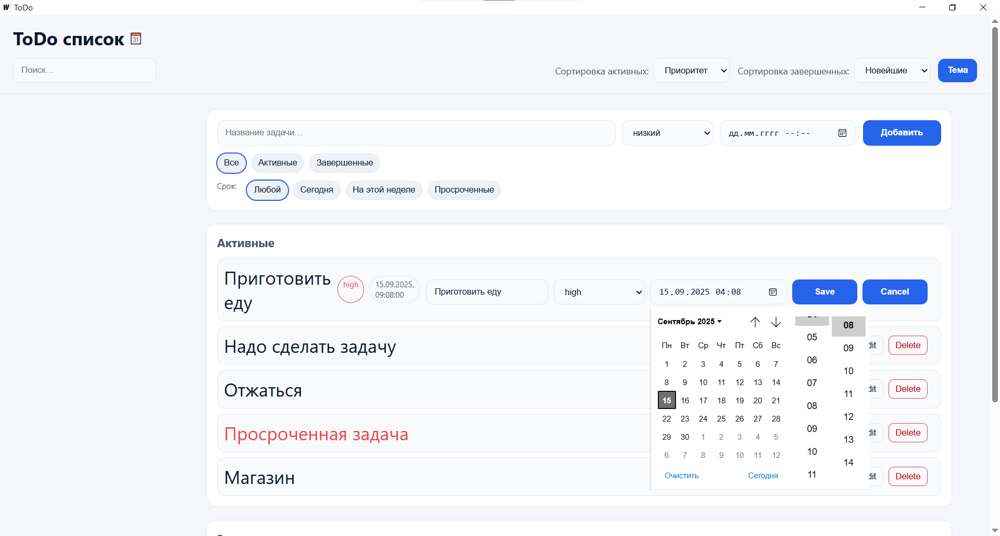

- **Подтверждение удаления**

  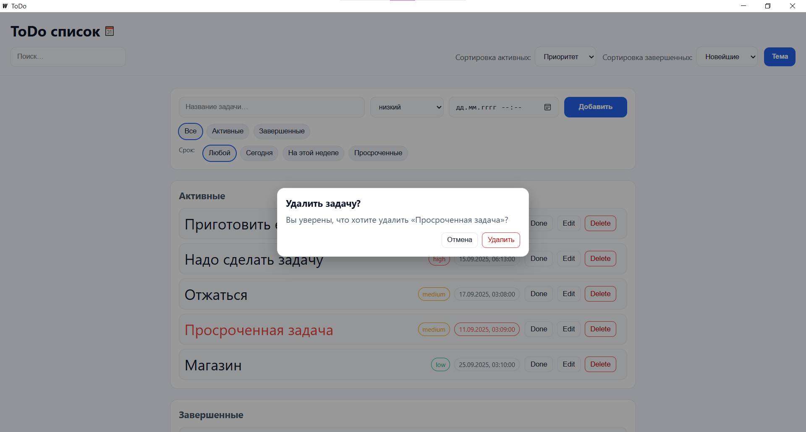


